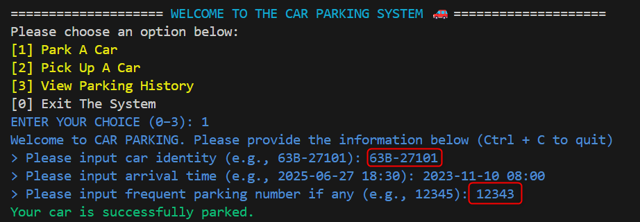

# Car Parking Management System

A simple Python-based command-line application to manage car parking, pickup, and history tracking using SQLite. Supports both interactive console UI and CLI.

## Features
- Park a car with optional frequent parking number (FPN)
- Pick up a car and calculate dynamic parking fee
- View and export parking history
- Two interfaces:
  - Interactive console (menu-driven)
  - CLI with flags for scripting
- SQLite3 database-backed storage
- Unit-tested fee calculator and handlers
- Parking fees vary by: 
   - Day of week
   - Time of day
   - Discount if FPN is valid.

## Usage
1. Clone this repository
2. Create tables for the car parking system if not exists.
   ```bash
   python database\create_tables.py
   ```
2. Install the required dependencies
   ```bash
   pip install -r requirements.txt
   ```
3. Install typer. This installs Typer along with its dependencies for CLI functionality, such as colorized output, prompt support, etc.
   ```bash
   pip install typer[all]
   ```
### Run the Console UI
1. Run the app
   ```bash
   python main.py
   ```
2. A user-friendly interactive console menu that prompts users like:
   ```bash
   [1] Park A Car
   [2] Pick Up A Car
   [3] View Parking History
   [0] Exit The System
   ```
### Run CLI Commands
1. Interactive Mode (no parameters)
   ```bash
   python main_cli.py park
   python main_cli.py pickup
   python main_cli.py history
   ```
2. With CLI parameters
   ```bash
   python main_cli.py park --car-id <car-id-input-value> --time <arrival-time-input-value> --fpn <fpn-input-value>

   python main_cli.py pickup --car-id <car-id-input-value> --time <leaving-time-input-value>

   python main_cli.py history --car-id <car-id-input-value>
   ```
## Exported History
- Exported to the exports/ directory
- Auto-named by: <car_identity>.txt

## Running Tests
   ```bash
   python -m unittest discover -s tests
   ```

## Examples - Console UI
### Park A Car
Case: Frequent Parking Number - Valid checked


Case: Frequent Parking Number - None


### Pick Up A Car


### View Parking History


### Exit The System


## Examples - CLI Commands
```bash
python main_cli.py park --car-id 63B-27101 --time "2025-06-28 09:00" --fpn 12345
python main_cli.py pickup --car-id 63B-27101 --time "2025-06-28 11:30"
python main_cli.py history --car-id 63B-27101
```
